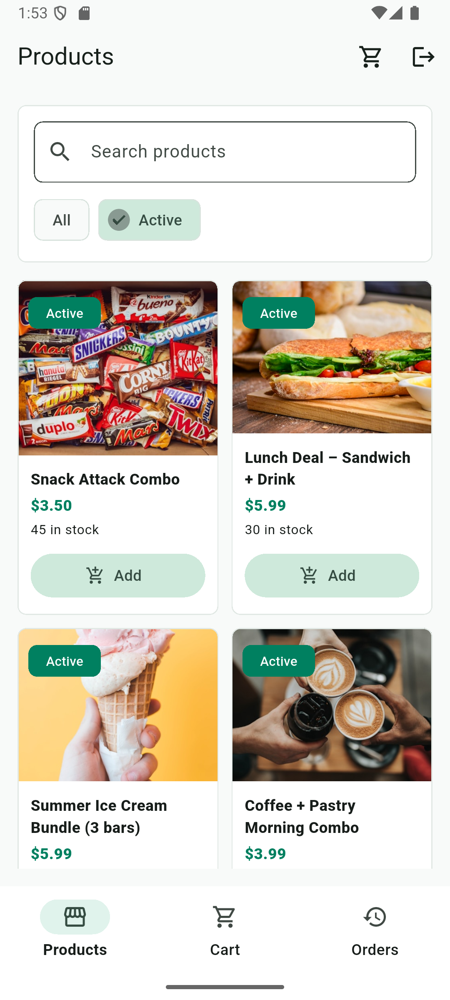
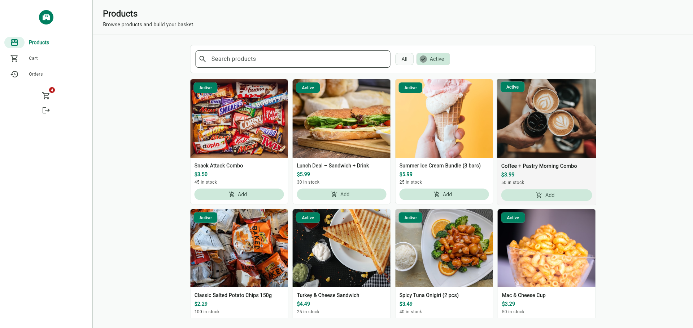
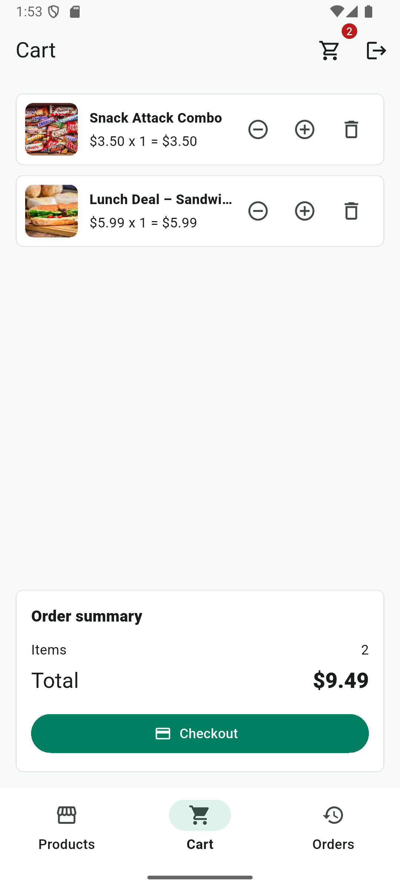
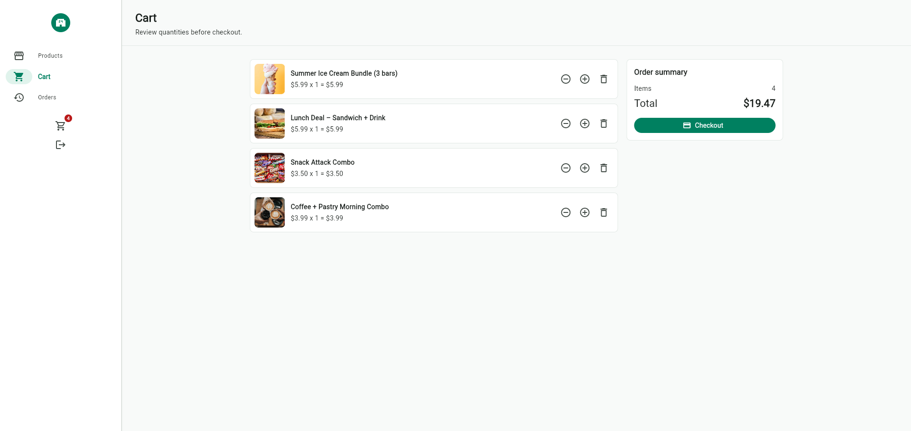
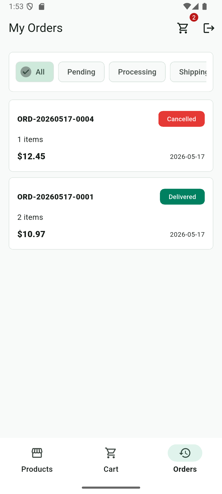
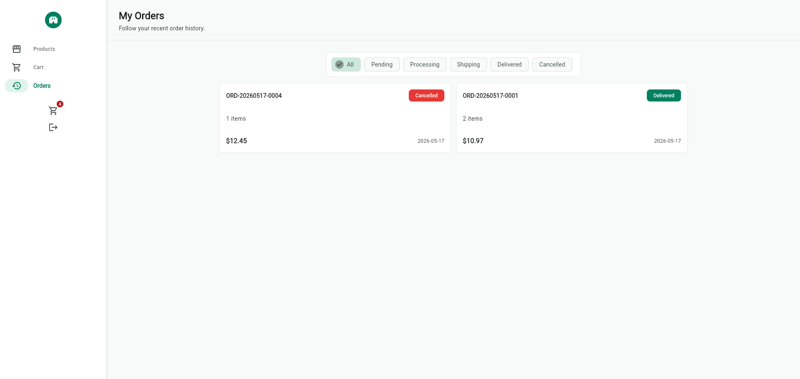
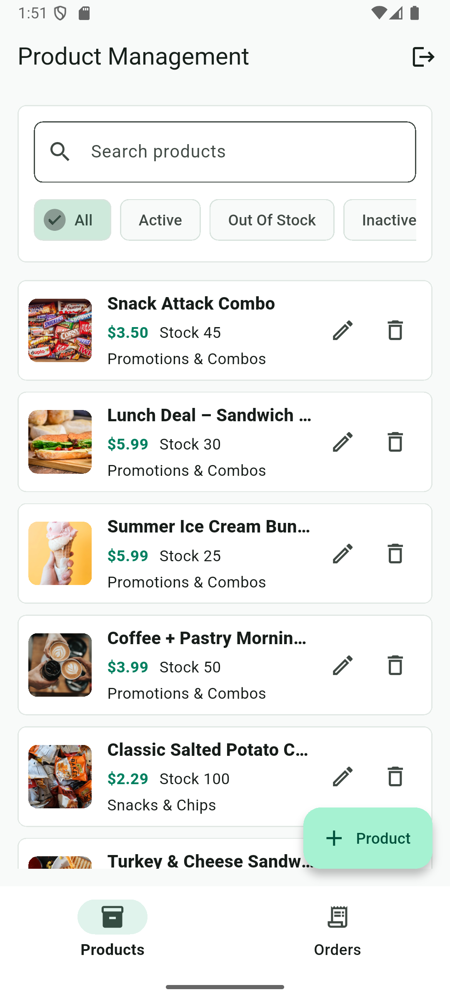
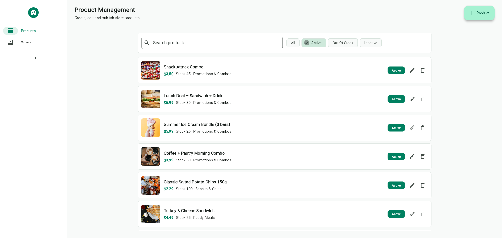
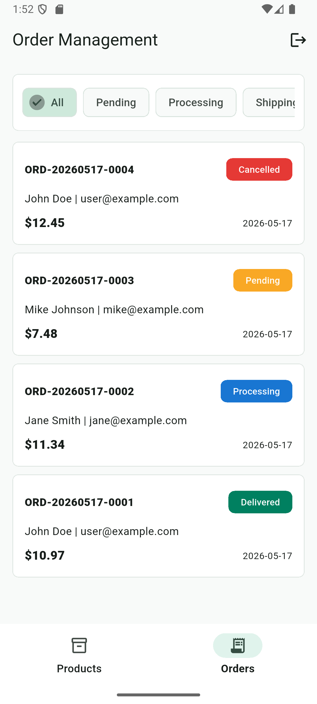
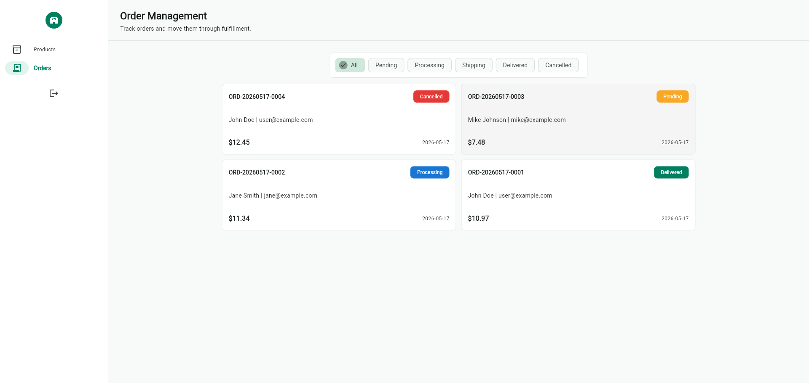

# 🏪 7-Eleven Product Management

A full-stack convenience store product & order management system built with **Flutter** (frontend) and **Node.js + Express** (backend), backed by **MongoDB Atlas** and deployed on **Firebase Hosting** + **Vercel**.

## 🌐 Live Demo

| Service  | URL |
|----------|-----|
| 🖥️ Frontend | [product-management-37df6.web.app](https://product-management-37df6.web.app) |
| ⚙️ API | [productmanagementserver.vercel.app](https://productmanagementserver.vercel.app/api) |

### Demo Accounts

| Role  | Email | Password |
|-------|-------|----------|
| Admin | `admin@example.com` | `Admin@123456` |
| User  | `user@example.com`  | `User@123456`  |

---

## 📸 screenshots

### User — Product Catalog
| Mobile | Web |
|--------|-----|
|  |  |

### User — Shopping Cart
| Mobile | Web |
|--------|-----|
|  |  |

### User — Order History
| Mobile | Web |
|--------|-----|
|  |  |

### Admin — Dashboard
| Mobile | Web |
|--------|-----|
|  |  |

### Admin — Order Management
| Mobile | Web |
|--------|-----|
|  |  |

---

## ✨ Features

### 🔐 Authentication & Authorization
- JWT-based login/register with role-based access control (Admin / User)
- Secure token storage with `SharedPreferences`
- Protected routes with middleware guards

### 🛍️ User Features
- Browse products with search, category filters, and status badges
- Responsive product grid with image gallery
- Shopping cart with quantity management
- Checkout and order placement
- Order history with status tracking

### 👨‍💼 Admin Features
- Dashboard overview with product and order statistics
- Full product CRUD (create, read, update, delete)
- Multipart image upload with Cloudinary integration
- Category management
- Order management with validated status transitions (`pending` → `confirmed` → `shipped` → `delivered`)

---

## 🏗️ Tech Stack

### Frontend
| Technology | Purpose |
|------------|---------|
| Flutter 3.x | Cross-platform UI framework |
| flutter_bloc | State management (BLoC pattern) |
| http | RESTful API communication |
| image_picker | Product image selection |
| shared_preferences | Local token persistence |

### Backend
| Technology | Purpose |
|------------|---------|
| Node.js + Express 5 | REST API server |
| MongoDB + Mongoose | Database & ODM |
| JWT (jsonwebtoken) | Authentication tokens |
| Cloudinary | Cloud image storage |
| Multer | Multipart file upload handling |
| bcryptjs | Password hashing |
| express-validator | Request validation |
| morgan | HTTP request logging |
| cors | Cross-origin resource sharing |

### Deployment
| Service | Purpose |
|---------|---------|
| Vercel | Serverless backend hosting |
| Firebase Hosting | Static frontend hosting |
| MongoDB Atlas | Cloud database |
| Cloudinary | CDN image storage |

---

## 📁 Project Structure

```
product_management/
├── lib/                          # Flutter frontend
│   ├── main.dart                 # App entry point
│   ├── app/                      # App configuration
│   ├── core/                     # Constants, utils, theme
│   ├── data/                     # Models, repositories, API services
│   └── presentation/
│       ├── blocs/                # BLoC state management
│       │   ├── auth/             # Auth bloc
│       │   ├── cart/             # Cart bloc
│       │   ├── category/         # Category bloc
│       │   ├── order/            # Order bloc
│       │   └── product/          # Product bloc
│       ├── pages/
│       │   ├── auth/             # Login / Register
│       │   ├── admin/            # Admin dashboard, products, orders
│       │   └── user/             # Catalog, cart, order history
│       ├── widgets/              # Reusable UI components
│       └── dialogs/              # Dialog widgets
│
├── backend/                      # Node.js backend
│   ├── api/index.js              # Vercel serverless entry point
│   ├── vercel.json               # Vercel routing config
│   ├── server.js                 # Local dev server
│   └── src/
│       ├── app.js                # Express app setup
│       ├── config/
│       │   ├── database.js       # MongoDB connection (cached for serverless)
│       │   └── env.js            # Environment variables
│       ├── controllers/          # Route handlers
│       ├── middleware/            # Auth & upload middleware
│       ├── models/               # Mongoose schemas
│       │   ├── User.model.js
│       │   ├── Product.model.js
│       │   ├── Category.model.js
│       │   └── Order.model.js
│       ├── routes/               # API route definitions
│       ├── services/             # Cloudinary service
│       └── utils/                # Seeder script
│
├── screenshots/                  # App screenshots
├── firebase.json                 # Firebase Hosting config
└── pubspec.yaml                  # Flutter dependencies
```

---

## 🔌 API Endpoints

### Auth
| Method | Endpoint | Description |
|--------|----------|-------------|
| POST | `/api/auth/register` | Register a new user |
| POST | `/api/auth/login` | Login and receive JWT |
| GET | `/api/auth/me` | Get current user profile |

### Products
| Method | Endpoint | Description |
|--------|----------|-------------|
| GET | `/api/products` | List all products (with search & filters) |
| GET | `/api/products/:id` | Get product by ID |
| POST | `/api/products` | Create product (Admin) |
| PUT | `/api/products/:id` | Update product (Admin) |
| DELETE | `/api/products/:id` | Delete product (Admin) |

### Categories
| Method | Endpoint | Description |
|--------|----------|-------------|
| GET | `/api/categories` | List all categories |
| POST | `/api/categories` | Create category (Admin) |
| PUT | `/api/categories/:id` | Update category (Admin) |
| DELETE | `/api/categories/:id` | Delete category (Admin) |

### Orders
| Method | Endpoint | Description |
|--------|----------|-------------|
| GET | `/api/orders` | List orders (Admin: all, User: own) |
| POST | `/api/orders` | Place a new order |
| PATCH | `/api/orders/:id/status` | Update order status (Admin) |

---

## 🚀 Getting Started

### Prerequisites
- [Flutter SDK](https://flutter.dev/docs/get-started/install) (3.x+)
- [Node.js](https://nodejs.org/) (18+)
- [MongoDB](https://www.mongodb.com/) (local or Atlas)
- [Cloudinary Account](https://cloudinary.com/) (for image uploads)

### Backend Setup (Local)

```bash
cd backend
npm install
cp .env.example .env    # or: copy .env.example .env (Windows)
```

Edit `backend/.env` with your credentials:

```env
MONGODB_URI=mongodb://127.0.0.1:27017/product_management
JWT_SECRET=replace_with_a_long_random_secret
CLIENT_URL=*
CLOUDINARY_CLOUD_NAME=your_cloud_name
CLOUDINARY_API_KEY=your_api_key
CLOUDINARY_API_SECRET=your_api_secret
CLOUDINARY_PRODUCT_FOLDER=7eleven/products
```

Seed the database and start the server:

```bash
npm run seed
npm run dev
```

### Flutter Setup (Local)

```bash
flutter pub get
flutter run --dart-define=API_BASE_URL=http://localhost:5000/api
```

For Android emulator, use `http://10.0.2.2:5000/api` instead.

---

## 🌍 Deployment

### Backend → Vercel

The backend is configured for serverless deployment with cached MongoDB connections. Push the `backend/` folder to a GitHub repo and import it in [Vercel](https://vercel.com). Set the environment variables (`MONGODB_URI`, `JWT_SECRET`, `CLIENT_URL`, Cloudinary keys) in the Vercel dashboard.

### Frontend → Firebase Hosting

Build with the production API URL, then deploy:

```bash
flutter build web --dart-define=API_BASE_URL=https://productmanagementserver.vercel.app/api
firebase deploy --only hosting
```

> **Note:** Make sure `CLIENT_URL` in your Vercel environment variables matches your Firebase Hosting domain to avoid CORS errors.

---

## 📄 License

This project is for educational purposes.
